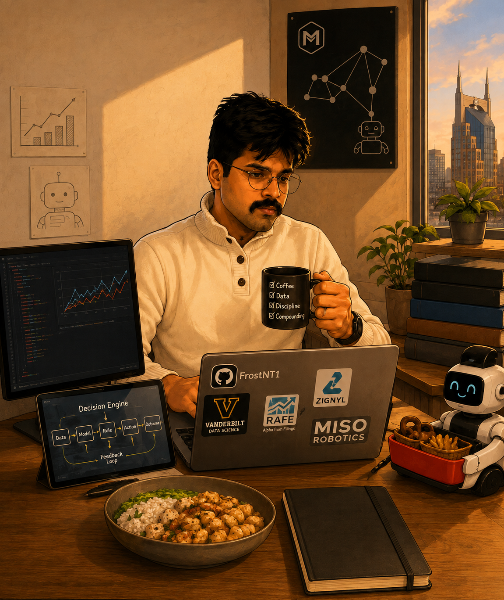

# Hi, I'm Shivam Tyagi 👋

### Applied Data Scientist · Forecasting & Decision Systems · Production ML

**M.S. in Data Science, Vanderbilt University**
Published researcher with four peer-reviewed papers and 30+ citations

---

## About Me

I build data and machine-learning systems that help people make better operational decisions under uncertainty.

My experience spans demand forecasting, natural-language analytics, computer vision, data pipelines, and applied ML research. I am particularly interested in the complete chain from **problem → prediction → decision rule → action → outcome**: not only whether a model is accurate, but whether it changes the right decision and produces measurable value.

I am currently developing deeper expertise in **forecasting and decision systems**, including cost-aware learning, optimization, uncertainty, and the operation of ML systems in real environments.

## Selected Professional Work

* **FarMart — Production forecasting and NLP:** Owned a production demand-forecasting workflow for maize and co-owned an NER system, including deployment, monitoring, retraining, dashboards, and stakeholder adoption.

* **Zignyl — Natural-language analytics:** Built the company’s first AI query engine for natural-language analytics across multi-store operations.

* **Miso Robotics — Forecasting for autonomous operations:** During my data science internship, developed and evaluated a demand-forecasting pipeline for autonomous restaurant operations across more than 100 locations. Prepared the pipeline, environment, and technical documentation for engineering productionization.

* **Medical-device computer vision:** Led a contract ML team building a CPU-deployable ONNX computer-vision service for wearable-device placement guidance.

* **[Negotiation and Team Resources](https://ainegotiation-ntr.com/alumni/) — Applied AI research:** Contributed as Lead AI Data Science Researcher and Full-Stack Developer to AI-assisted negotiation research and product development.

## Research

I have authored or co-authored four peer-reviewed publications spanning machine learning, applied AI, photovoltaic-system analysis, and technology adoption.

* **30+ Google Scholar citations**
* **Two first-author publications**
* Research experience across forecasting, ensemble learning, fault detection, and applied analytics

[View my publications on Google Scholar →](https://scholar.google.com/citations?hl=en&user=NfktfdwAAAAJ)

## Selected Open Work

### [QuantFolio Engine](https://github.com/FrostNT1/quantfolio-engine)

A research-oriented portfolio construction and evaluation framework for studying how investment strategies behave under uncertainty. The project includes factor and regime analysis, Black–Litterman allocation, Monte Carlo simulation, walk-forward backtesting, transaction costs, benchmarks, and portfolio-risk evaluation.

### [TabPFN Stock Prediction](https://github.com/FrostNT1/TabPFN-Stock-Prediction)

An exploration of transformer-based tabular learning for financial prediction, including feature engineering, model evaluation, and comparison with conventional approaches.

## Writing

I write about forecasting, decision-making, applied machine learning, finance, and the changing nature of technical work.

* [Forecasting Isn’t About Being Right. It’s About Being Useful.](https://medium.com/@st.shivamtyagi.01/forecasting-isnt-about-being-right-it-s-about-being-useful-a91be88ca7e1)
* [QuantFolio: Designing Portfolios That Survive Uncertainty](https://medium.com/@st.shivamtyagi.01/quantfolio-designing-portfolios-that-survive-uncertainty-c5c00adcf029)
* [The Data Science Blueprint](https://medium.com/@st.shivamtyagi.01/the-data-science-blueprint-d5be40aaf860)
* [More writing on Medium →](https://medium.com/@st.shivamtyagi.01)

## Technical Toolkit

**Languages and analysis:** Python, SQL, R, pandas, NumPy
**Machine learning:** scikit-learn, PyTorch, LightGBM, XGBoost, Hugging Face
**Optimization and deployment:** CVXPY, ONNX, AWS, Azure, Linux
**Data systems:** PostgreSQL, MongoDB, SSIS, Metabase
**Workflow:** Git, Jira, testing, reproducible experimentation, technical documentation

---

### Building systems that connect predictions to decisions—and decisions to measurable outcomes.

